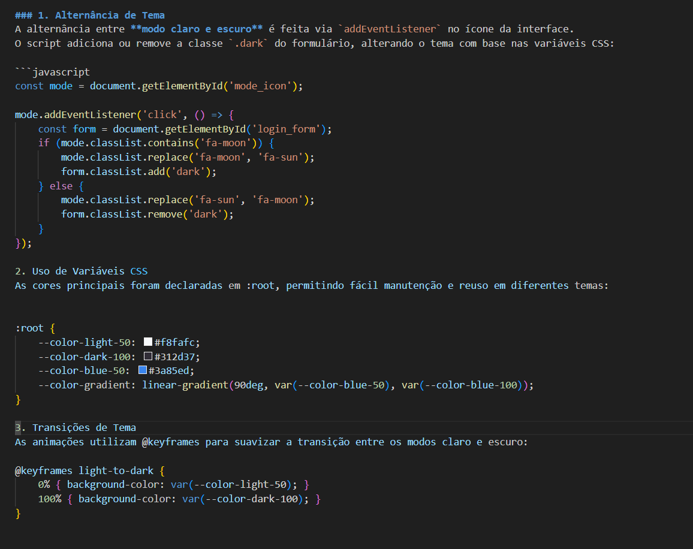

# 💻 Formulário de Login — Modo Claro e Escuro

Este projeto consiste em um **formulário de login responsivo** com alternância entre **modo claro e escuro**, desenvolvido em **HTML5**, **CSS3** e **JavaScript puro (Vanilla JS)**.  
O objetivo é demonstrar domínio de manipulação do DOM, uso de variáveis CSS, transições animadas e boas práticas de estruturação de um projeto front-end.

---

## 🧠 Objetivos Técnicos

- Implementar alternância de tema (dark/light) com manipulação dinâmica de classes via JavaScript.  
- Utilizar **variáveis CSS (`:root`)** para gerenciar paletas de cores.  
- Aplicar **animações e transições suaves** com `@keyframes`.  
- Demonstrar organização de projeto front-end em pastas sem dependências externas.  
- Integrar ícones vetoriais via **Font Awesome CDN**.  

---

## 🧩 Estrutura do Projeto

```bash
📦 projeto-login-dark-light
├── index.html # Estrutura HTML principal
├── assets/
│ ├── css/
│ │ └── style.css # Estilos e temas claro/escuro
│ ├── js/
│ │ └── scrip.js # Lógica de alternância de tema
│ └── imgs/ # Ícones das redes sociais


---

## ⚙️ Tecnologias Utilizadas

| Tecnologia | Função Principal |
|-------------|------------------|
| **HTML5** | Estruturação semântica da página |
| **CSS3** | Estilização, variáveis e animações |
| **JavaScript (Vanilla)** | Manipulação de DOM e alternância de tema |
| **Font Awesome** | Ícones vetoriais interativos |

---

## 🧱 Detalhes de Implementação

### 1. Alternância de Tema
A alternância entre **modo claro e escuro** é feita via `addEventListener` no ícone da interface.  
O script adiciona ou remove a classe `.dark` do formulário, alterando o tema com base nas variáveis CSS:

```javascript
const mode = document.getElementById('mode_icon');

mode.addEventListener('click', () => {
    const form = document.getElementById('login_form');
    if (mode.classList.contains('fa-moon')) {
        mode.classList.replace('fa-moon', 'fa-sun');
        form.classList.add('dark');
    } else {
        mode.classList.replace('fa-sun', 'fa-moon');
        form.classList.remove('dark');
    }
});
```

### 2. Uso de Variáveis CSS
As cores principais foram declaradas em :root, permitindo fácil manutenção e reuso em diferentes temas:

```css
:root {
    --color-light-50: #f8fafc;
    --color-dark-100: #312d37;
    --color-blue-50: #3a85ed;
    --color-gradient: linear-gradient(90deg, var(--color-blue-50), var(--color-blue-100));
}


```

### 3. Transições de Tema
As animações utilizam @keyframes para suavizar a transição entre os modos claro e escuro:
```css
@keyframes light-to-dark {
    0% { background-color: var(--color-light-50); }
    100% { background-color: var(--color-dark-100); }
}
```

### 🧠 Conceitos Aplicados

- Manipulação de classes no DOM (classList.add/remove/contains)

- Animações com @keyframes

- Responsividade e centralização com Flexbox

- Uso de variáveis CSS globais (:root)

- Boas práticas de organização de projeto front-end

### 🧑‍💻 Autora

Alice Barbosa de Souza

Professora de Física e Desenvolvedora em formação

📚 Cursando Análise e Desenvolvimento de Sistemas

💡 Interesse em Front-end, UI/UX 

🔗 LinkedIn

🔗 GitHub